# Exercise 1: Entra Agent ID - Identity for Agents

### Estimated Duration: 60 minutes

Before an AI agent can be governed, it has to exist as a first-class identity in your directory. In this exercise you give Contoso's expense-processing agent, **Finley**, an enterprise identity in Microsoft Entra, establish who is accountable for it, and confirm it is discoverable in the Agent 365 registry.

## Overview

Human employees get an identity before they get a laptop or a mailbox. AI agents work the same way. **Microsoft Entra Agent ID** provides purpose-built identity constructs for agents so you can authenticate, authorize, govern, and protect them at enterprise scale.

Two constructs matter in this exercise:

- An **agent identity blueprint** is the reusable template that defines a class of agent. It declares which permissions agents of this kind may request and who is accountable for the class. If Contoso later wants ten expense agents, all ten come from this one blueprint. Every blueprint also has an **agent blueprint principal** - the service principal that actually holds the granted permissions.
- An **agent identity** is a specific agent created from that blueprint. This is Finley. It is the identity that actually requests access tokens and performs work.

You will also confirm an **owner** and a **sponsor**. A sponsor is the person accountable for why the agent exists, similar to a hiring manager, and is required. An owner is the person who can change the agent's configuration, and is recommended.

In this exercise you will:

- Verify the Agent 365 CLI and authenticate to Azure
- Provision the agent blueprint, its principal, permissions, and agent identity in a single command
- Verify the blueprint and its granted permissions in the Microsoft Entra admin center
- Confirm and complete owner and sponsor accountability in the portal
- Confirm the agent appears in the Agent 365 registry

## Objectives

- **Task 1**: Verify the Agent 365 CLI and authenticate to Azure
- **Task 2**: Provision the agent blueprint using the Agent 365 CLI
- **Task 3**: Verify the blueprint and permissions in Microsoft Entra
- **Task 4**: Confirm and complete owner and sponsor accountability
- **Task 5**: Confirm the agent in the Agent 365 registry

### Task 1: Install the Agent 365 CLI and authenticate to Azure

In this task you prepare your tooling. The Agent 365 CLI is a .NET global tool, so you first confirm .NET is present, then install the CLI and authenticate to Azure.

1. On the lab virtual machine, select the **Search**, type **Windows PowerShell (1)**, and select **Windows PowerShell (2)**.

    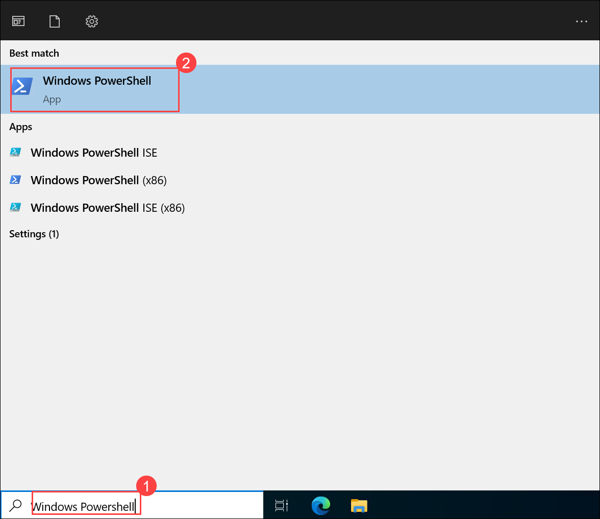

1. Confirm that .NET 8.0 or later is installed by running the following command:

    ```
    dotnet --version
    ```

    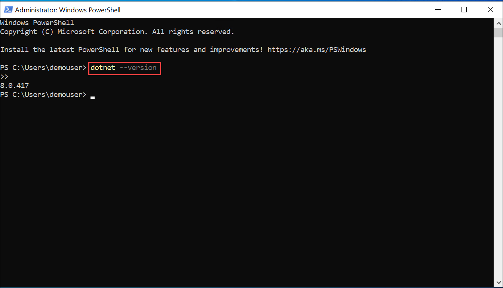

1. Install the Agent 365 CLI globally by running the following command:

    ```
    dotnet tool install --global Microsoft.Agents.A365.DevTools.Cli
    ```

    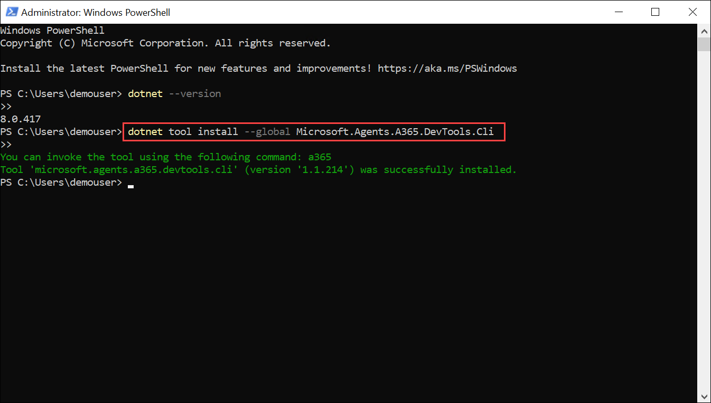

    >**Note:** If the CLI is already installed, this command reports that the tool is already installed. In that case, run `dotnet tool update --global Microsoft.Agents.A365.DevTools.Cli` instead to ensure you are on the latest version.

1. Verify the CLI runs by displaying its help:

    ```
    a365 -h
    ```

    You should see the CLI version banner and the list of available commands, including `setup`, `query-entra`, `publish`, and `cleanup`. This confirms the CLI is on your path and ready to use.

    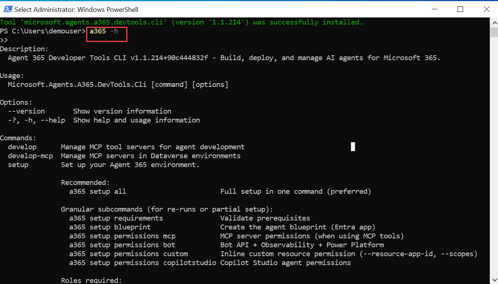

    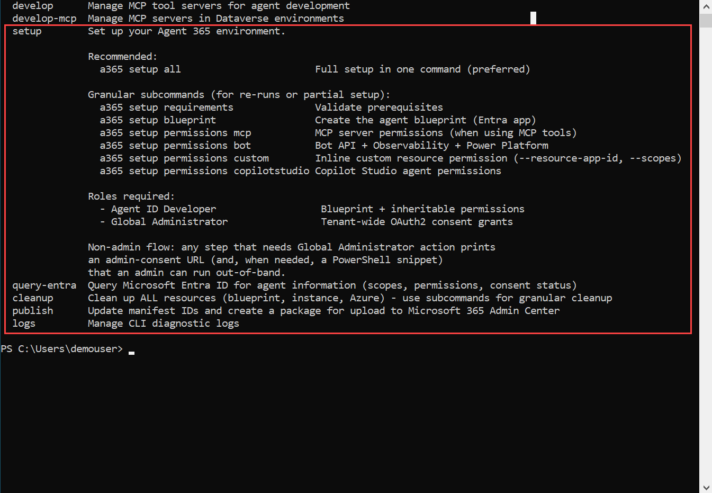

    >**Note:** If `a365` is not recognized, close and reopen PowerShell so the shell picks up the .NET global tools folder on your path.

1. Authenticate to Azure. The CLI resolves your tenant from the Azure CLI context, so it needs an authenticated Azure session.

    ```
    az login
    ```

    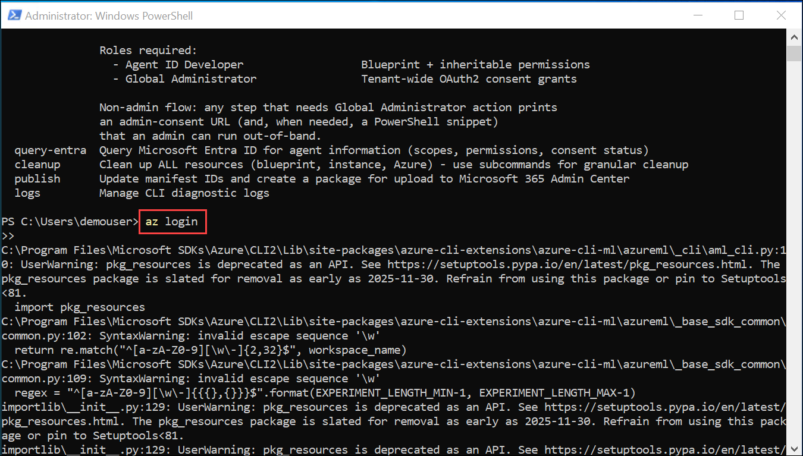

1. A Sign in window appears, select **Work or school account**.

1. Sign in with the following credentials:

   - **Email/Username:** <inject key="AzureAdUserEmail"></inject>

   - **Temporary Access Pass:** <inject key="AzureAdUserPassword"></inject>

1. **Sign in to all apps and websites on this device? pop up appears**, select **No, this app only**.
 
1. In powershell window if prompted to select a subscription and tenant, press **Enter**.

1. Return to PowerShell and confirm the correct subscription and tenant are selected:

    ```
    az account show
    ```

    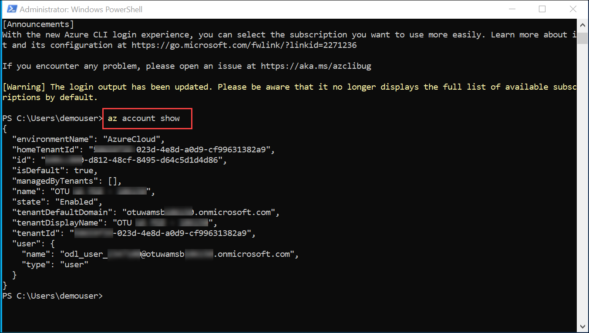

    >**Note:** If you are already signed in from a previous session, `az account show` returns your context and you can skip `az login`.

You now have the Agent 365 CLI verified and an authenticated Azure context.

### Task 2: Provision the agent blueprint using the Agent 365 CLI

In this task you run a single command that does a surprising amount of work: it registers the agent identity blueprint and its principal in Microsoft Entra, configures the inheritable Microsoft Graph and Agent 365 permissions that agent identities will receive, creates the agent identity, and registers the agent in the Agent 365 registry.

>**Note:** This command is **interactive**. It pauses for a confirmation prompt and opens a browser for admin consent. Stay at the keyboard for the whole run - do not start it and walk away.

1. In PowerShell, create and move into a clean working folder for the agent. The CLI writes its configuration output here, so keep track of this folder.

    ```
    New-Item -ItemType Directory -Path C:\LabFiles\finley -Force
    cd C:\LabFiles\finley
    ```

    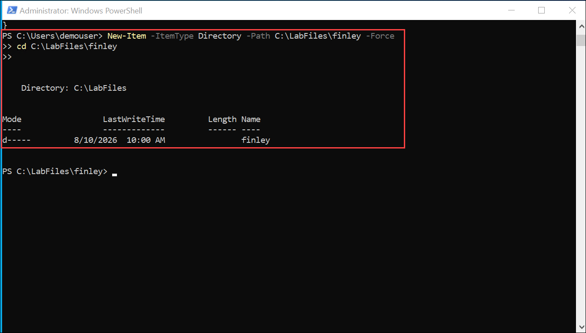

1. Run the setup command. This creates the blueprint in config-free mode, meaning the CLI resolves your tenant and client app automatically without requiring a configuration file.

    ```
    a365 setup all --agent-name finley-<inject key="DeploymentID" enableCopy="false"/>
    ```
    
    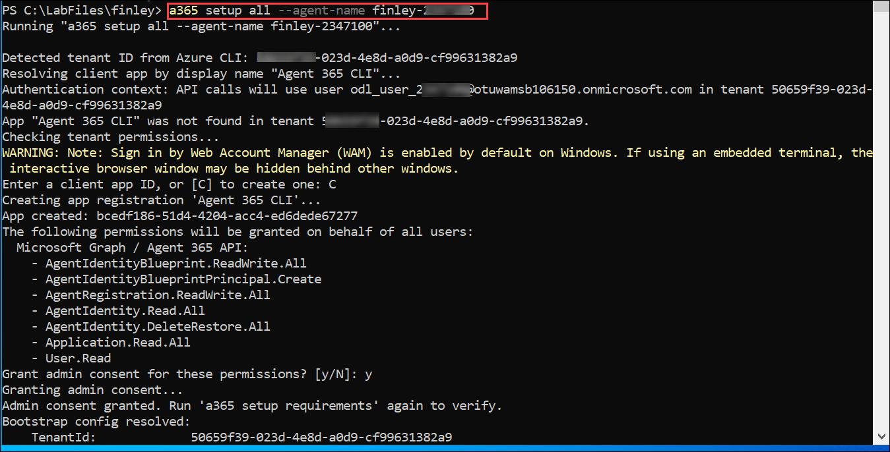

    >**Note:** For Enter a cliennt app ID, or [C] to create one: type **C**.

    >**Note:** Enter the sign in details from the environment tab.

1. The CLI opens a browser window requesting admin consent for the permissions the blueprint needs. Review the requested permissions and select **Accept**.

1. The CLI then configures inheritable permissions and pauses at a prompt:

    ```
    Assign this application permission now? [y/N]:
    ```

    Type **y** and press **Enter**.

    >**Note:** If  prompted to provide consent type **y** in all state. 

1. The CLI opens a browser window requesting **admin consent** for the delegated permissions the blueprint needs. Review the requested permissions and select **Allow**.

    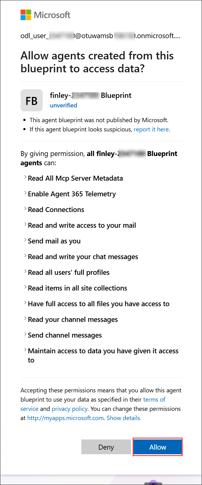

    >**Note:** The CLI polls for consent for **180 seconds**, printing progress messages such as `Still waiting for admin consent... (34s / 180s)` while it waits. Complete the consent within that window.

1. **Expected behavior:** after you select **Allow**, the browser tab will most likely show an error page similar to the following:

    ```
    Try that again using a different browser
    We couldn't connect to that service, likely because of settings put in place
    by your IT team. Open Azure in a different Web browser to try again.
    ```

    **This is expected and harmless. Your consent has already succeeded.** Do not switch browsers, and do not re-run consent. Simply leave the tab and return to PowerShell.

1. Return to PowerShell and wait for the CLI to confirm:

    ```
    Consent granted (All permissions).
    ```
    Once you see this line, consent completed successfully regardless of what the browser tab displayed.

    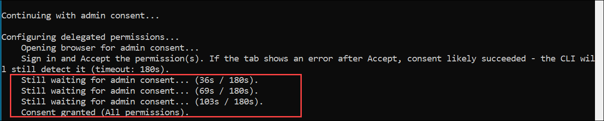

    >**Note:** Consent has only genuinely failed if the CLI reaches the 180-second timeout **without** printing `Consent granted`. In that case, re-run `a365 setup all --agent-name finley-<inject key="DeploymentID" enableCopy="false"/>` and type **y** at the permission prompt.

1. Wait for the command to complete and read the **Setup Summary** block. This is your authoritative success check. Confirm all seven lines and the final message:

    ```
    Setup Summary

      1. Prerequisites                validated
      2. Blueprint                    created  'finley-<DeploymentID> Blueprint' (ID: ...)
      3. Inheritable Permissions      configured
      4. Blueprint Permission Grants  granted  tenant-wide delegated
      5. Agent identity               created  'finley-<DeploymentID> Identity' (ID: ...)
      6. Agent Registration           registered  'finley-<DeploymentID> Agent' (ID: T_...)
      7. Messaging endpoint           skipped (non-M365 agent)

    Setup completed successfully
    ```

    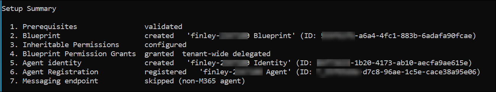

    >**Note:** If you re-run the command, line 2 reads **reused** instead of **created**. That is expected.

1. Inspect the generated configuration file to capture the identifiers you will need in later exercises:

    ```
    Get-Content a365.generated.config.json | ConvertFrom-Json
    ```

1. Confirm the following key values are present, and copy them into a text file for reference:

    | Field | What it is | What to check |
    | --- | --- | --- |
    | `agentBlueprintId` | The blueprint's application (client) ID | Should be a valid GUID |
    | `agentBlueprintObjectId` | The blueprint's object ID in Microsoft Entra | Should be a valid GUID. For agent blueprints this is the **same value** as `agentBlueprintId` |
    | `agentBlueprintServicePrincipalObjectId` | The object ID of the agent blueprint **principal**, which holds the granted permissions | Should be a valid GUID, different from the two above |
    | `agenticAppId` | The **agent identity** created from the blueprint | Should be a valid GUID |
    | `agentRegistrationId` | The agent's entry in the Agent 365 registry | Should start with `T_` |
    | `resourceConsents` | The APIs consented to | Should list four resources: **Microsoft Graph**, **Agent 365 Tools**, **Observability API**, **Power Platform API**, each with `consentGranted: True` |

    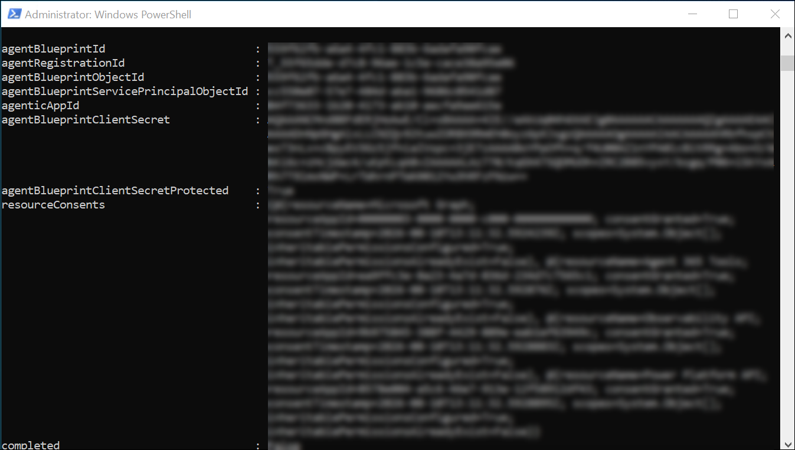

    >**Note:** This file also contains a `completed` field. In the current CLI version it remains **False** even after a fully successful run, so **ignore it**. Use the **Setup Summary** block from the previous step and the `consentGranted: True` values above as your success check.

Finley now has a registered agent identity blueprint, an agent identity, and a registry entry.

### Task 3: Verify the blueprint and permissions in Microsoft Entra

Creating the blueprint through the CLI is fast, but as an administrator you should always confirm what was actually created in the directory. This entire task is done in the portal.

1. Open a new browser tab and navigate to the Microsoft Entra admin center:

    ```
    https://entra.microsoft.com
    ```

1. In the left navigation pane, expand **Entra ID (1)**, select **Agents (2)**, and then select **Agent blueprints (3)**.

1.  Confirm your blueprint **finley-<inject key="DeploymentID" enableCopy="false"/> Blueprint (4)** appears in the list.

    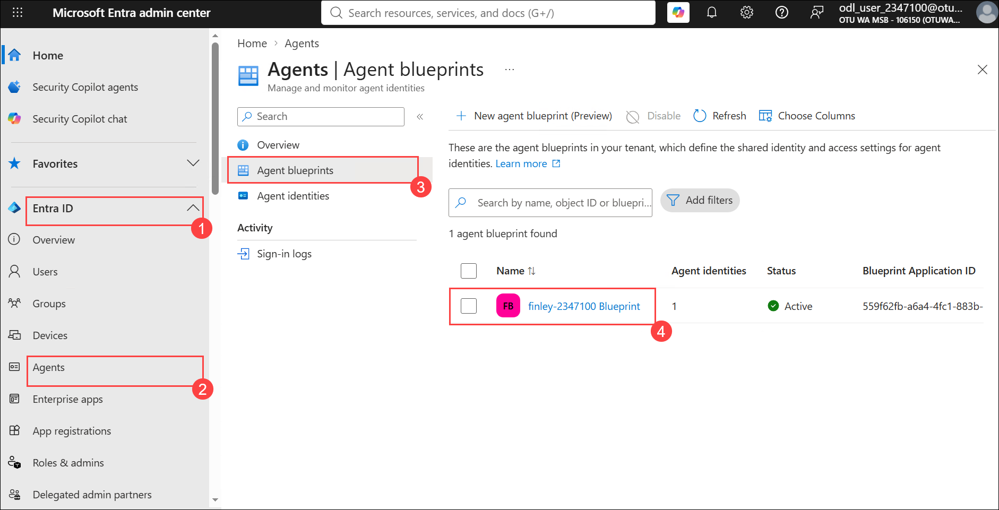

1. Select your blueprint to open its management page.

1. Under **Access**, select **Granted permissions (1)**.

1. Make sure the **Admin consent (2)** tab is selected. Confirm you see entries for all four resources, and review the **API name**, **Claim value**, **Permission**, **Type**, and **Granted through** columns **(3)**.

    | API name | Claim values you should see |
    | --- | --- |
    | Microsoft Graph | `Mail.ReadWrite`, `Mail.Send`, `Chat.ReadWrite`, `User.Read.All`, `Sites.Read.All`, `Files.ReadWrite.All`, `ChannelMessage.Read.All`, `ChannelMessage.Send` |
    | Agent 365 Tools | `McpServersMetadata.Read.All` |
    | Observability API | `Agent365.Observability.OtelWrite` |
    | Power Platform API | `Connectivity.Connections.Read` |

    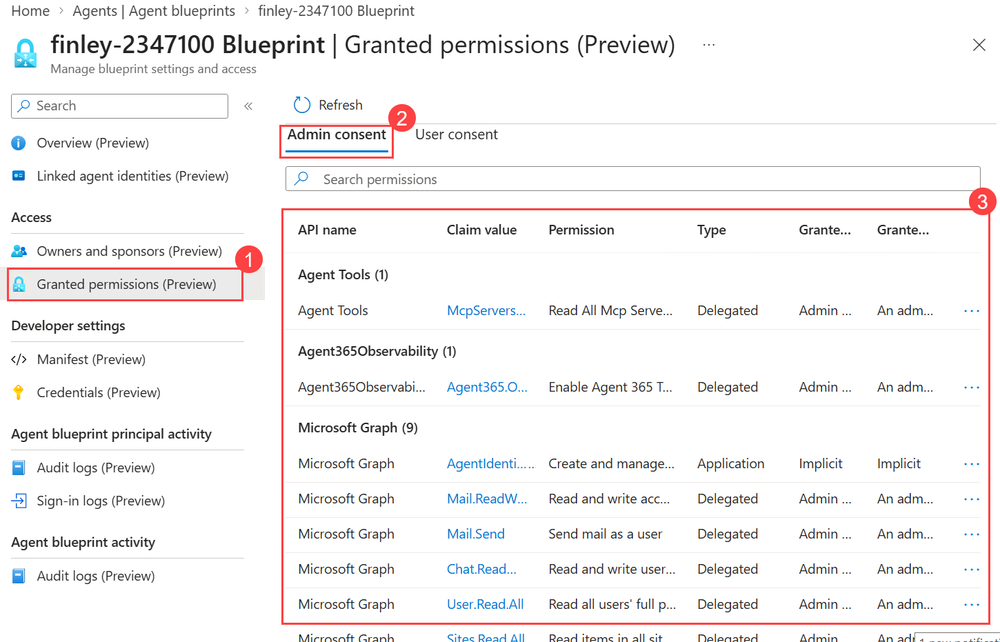

1. In the left menu, select **Linked agent identities (1)**. Confirm that the agent identity **finley-<inject key="DeploymentID" enableCopy="false"/> Identity** appears, and note its **Status** and **Owners and Sponsors** columns **(2)**.

    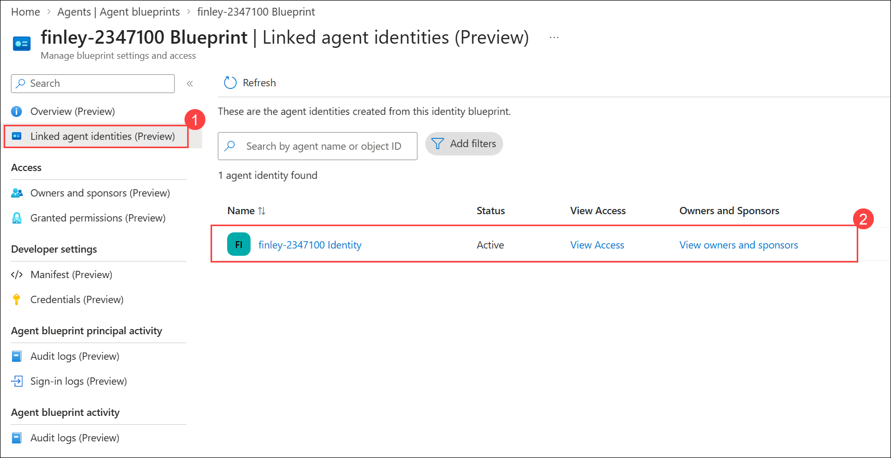

1. Now confirm the identity is also visible in the tenant-wide list. Navigate to **Entra ID (1)** > **Agents (2)** > **Agent identities (3)**,  and confirm your agent **identity (4)** appears.

    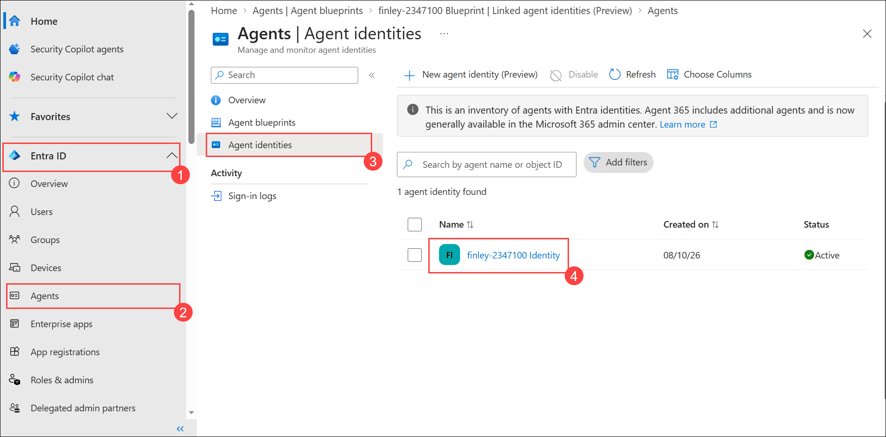

### Task 4: Confirm and complete owner and sponsor accountability

An agent with no accountable human is a governance gap, and the Microsoft 365 admin center surfaces "agents without owners" as a governance action precisely because ownerless agents accumulate risk.

The Agent 365 CLI assigns you as **owner and sponsor of the agent blueprint** when it creates it, but it stops there. In this task you verify what the CLI did, then close the two gaps it leaves: the **agent blueprint principal has no owner or sponsor**, and the **agent identity has a sponsor but no owner**.

1. Still in the Microsoft Entra admin center, navigate to **Entra ID (1)** > **Agents (2)** > **Agent blueprints (3)**.

1. Select your blueprint **finley-<inject key="DeploymentID" enableCopy="false"/> Blueprint (4)**.
  
    

1. Under **Access**, select **Owners and sponsors (1)**.

1. Select the **Agent blueprint (2)** tab. Confirm that your lab user account is already listed as both an **Owner and Sponsor (3)**.

    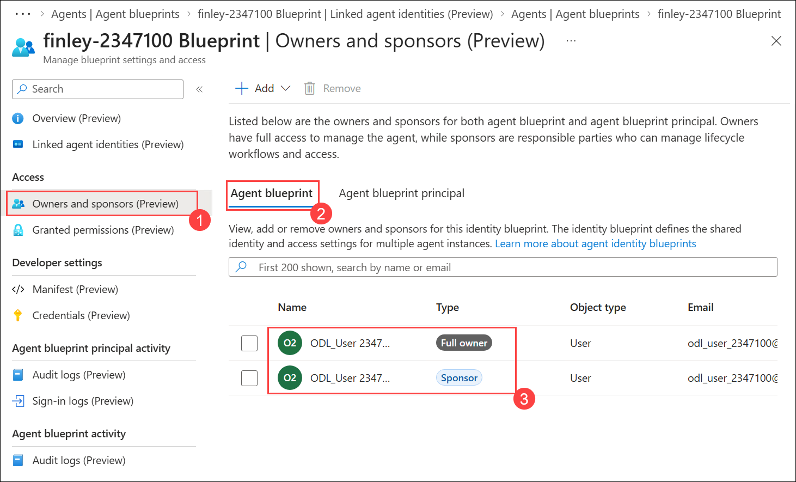

1. Select the **Agent blueprint principal** tab. Unlike the **Agent blueprint** tab, this tab is **empty** - the CLI does not populate it. You will add both an owner and a sponsor here.

    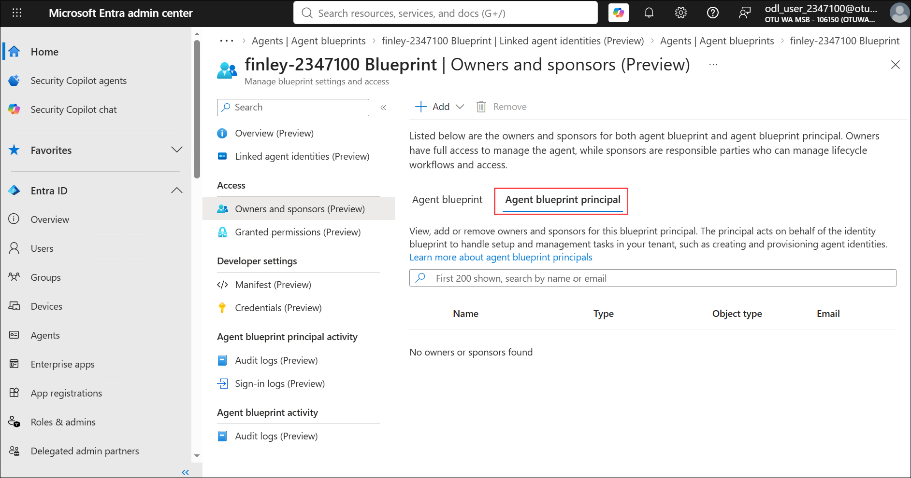

1. Select **Add (1)** > **Add owner (2)**, search for and select your lab user account **(3)**, and then click **Select (4)**.

    >**Note:** Your User account should be: ODL_User <inject key="DeploymentID" enableCopy="false"/>

    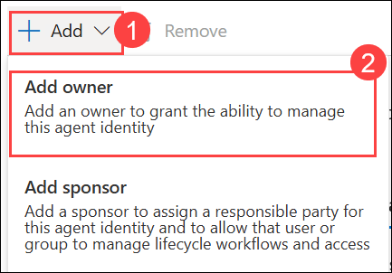

    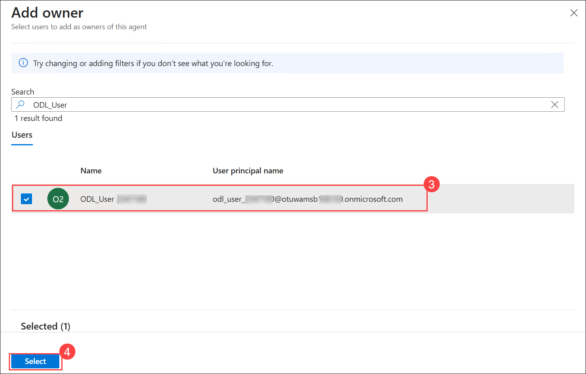

1. Select **Add** > **Add sponsor**, search for and select your lab user account, and then click **Select**.

1. Confirm the **Agent blueprint principal** tab now lists your lab user account as both an owner and a sponsor.

    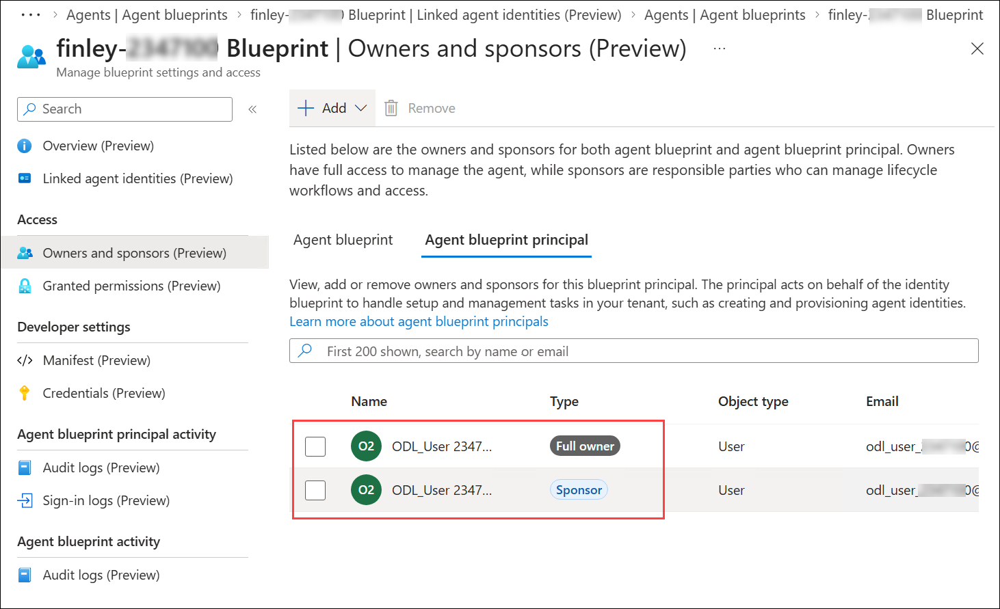

1. Now handle the agent identity, where a real gap exists. Navigate to **Entra ID** > **Agents** > **Agent identities**.

1. Select the agent identity **finley-<inject key="DeploymentID" enableCopy="false"/> Identity**.

1. Under **Access**, select **Owners and sponsors**. Note that a **Sponsor** is already recorded but the **Owners** list is **empty**.

1. Select **Add (1)** > **Add owner (2)**.

    

1. Search for and select your lab user account **(3)**, then click **Select (4)**.

    

1. Confirm the identity now shows both an owner and a sponsor. 

    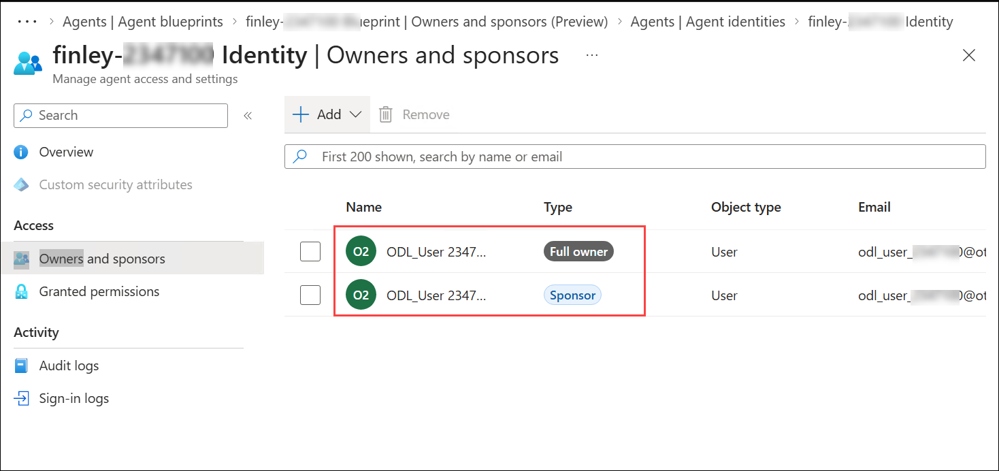

Finley now has an accountable owner and sponsor recorded on all three objects: the agent blueprint, the agent blueprint principal, and the agent identity.

### Task 5: Confirm the agent in the Agent 365 registry

The Microsoft Entra admin center shows you the identity. The **Agent 365 registry** in the Microsoft 365 admin center is the control plane where IT observes and governs every agent in the tenant, regardless of where it was built. Confirming the agent appears here proves the platform has accepted it.

1. Switch to the browser tab with the Microsoft 365 admin center, or navigate to:

    ```
    https://admin.microsoft.com/
    ```

1. In the left navigation pane, expand **Agents (1)** and select **Overview (2)**.

    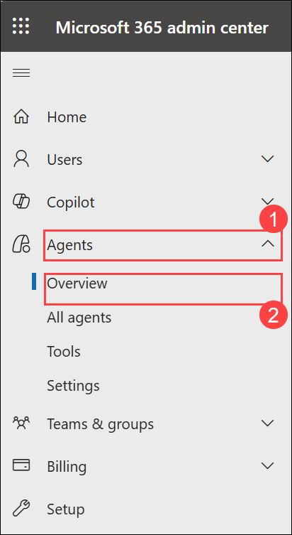

1. Review the **Agent overview** dashboard and its governance action cards, which surface items such as **Pending requests**, **Agents at risk**, and **Agents without owners**.

    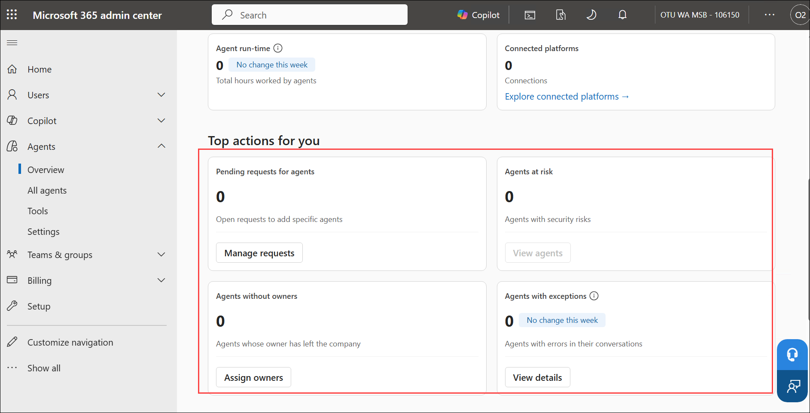

1. Select **Agents (1)** > **All agents (2)**, and make sure the **Registry (3)** tab is selected.

    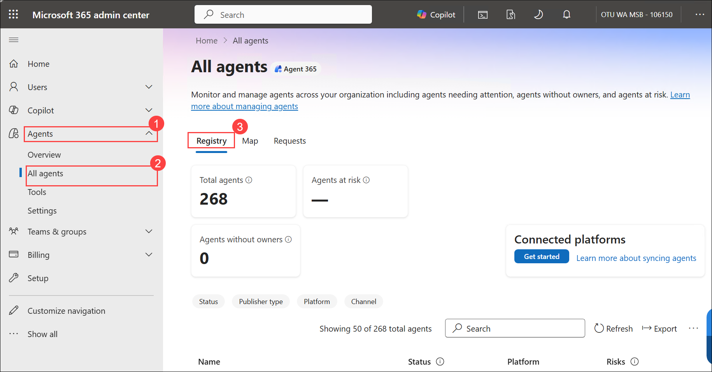

1. Note the tenant-wide summary tiles above the list: **Total agents**, **Agents without owners**, and **Agents at risk**.

    >**Note:** Applying filters to the list does not change the **Total agents** count.

1. In the search box, type **finley (1)** and confirm your agent appears in the registry **(2)**.

    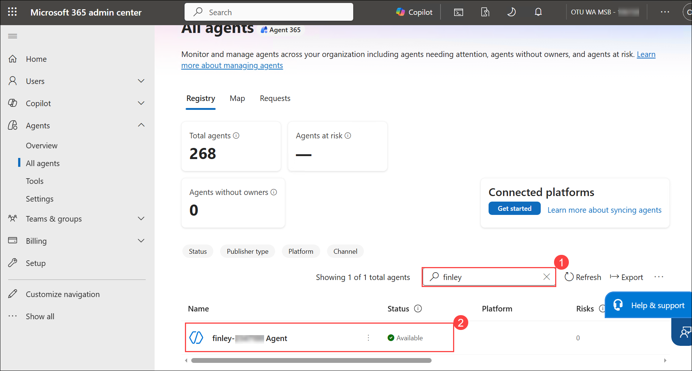
  
1. Confirm the **Status** column reads **Available** and the **Risks** column reads **0**.

1. Select your agent to open the agent details pane. Review the following:

   - The **Owner** you confirmed in Task 4
   - The agent's **Permissions**
   - The **Status** of the agent

## Conclusion

In this exercise you gave Contoso's expense agent a real enterprise identity. You verified the Agent 365 CLI, provisioned an agent identity blueprint together with its principal, its inheritable Graph permissions, an agent identity, and a registry entry, verified in the Microsoft Entra admin center that permissions were actually granted rather than left pending, confirmed and completed owner and sponsor accountability at both the blueprint and identity level, and confirmed the agent is visible in the Agent 365 registry.

The important idea here is sequencing. Identity comes first, because every governance control in the exercises that follow, whether a Conditional Access policy, a device compliance requirement, or an audit query, targets this identity. Without it, there is nothing to govern.

## Review

In this exercise, you have completed the following:

- Verified the Agent 365 CLI and authenticated to Azure
- Provisioned the agent blueprint using the Agent 365 CLI
- Verified the blueprint and permissions in Microsoft Entra
- Confirmed and completed owner and sponsor accountability
- Confirmed the agent in the Agent 365 registry

## Summary

In this exercise, you created an agent identity blueprint and agent identity in Microsoft Entra using the Agent 365 CLI, established accountability through owners and sponsors, and verified the agent is discoverable and governable in the Agent 365 registry. This identity is the foundation for the policies, compute, and observability you configure in the remaining exercises.

Click **Next** from the lower right corner to move on to the next page.


