# Exercise 2: Agent 365 Policy Conformance

### Estimated Duration: 60 minutes

Finley now exists as an identity, but nothing constrains it. In this exercise you put guardrails around it: you review the protections Microsoft ships by default, configure tenant-wide agent settings, and build two Conditional Access policies that decide what Finley can reach and under what conditions.

## Overview

**Agent 365 policy templates** bundle predefined governance and security policies drawn from four different Microsoft services, so you get consistent protection without configuring each service separately:

- **Microsoft Entra** provides identity protection, lifecycle management, and network visibility
- **Microsoft Purview** provides audit logging, sensitive information detection through DSPM for AI, and compliance assessment
- **SharePoint Online** provides access control and content permission insights
- **Microsoft Defender** provides real-time protection and advanced hunting

You will review the default template rather than build one, because Microsoft's built-in policies are locked and cannot be edited, and custom policies inside an Agent 365 template are not yet supported. Instead, you will build the equivalent controls **natively in Microsoft Entra**, where they are generally available today. This gives you the same enforcement with a fully supported path.

Two Conditional Access patterns matter for agents:

- **Attribute-driven access**: You tag agent identities with **custom security attributes**, then write a policy that targets those tags. As the number of agents grows, managing each one individually in every policy becomes unsustainable. Tagging scales; individual selection does not.
- **Risk-based access**: You block agents that Microsoft Entra ID Protection flags as high risk, the same way you would block a risky user sign-in.

>**Note:** Every Conditional Access policy in this exercise is created in **Report-only** mode first. Report-only mode evaluates the policy and logs what *would* have happened without actually enforcing it. This is how you validate a policy safely before it can lock out a legitimate agent.

>**Note:** This exercise targets **agent identities**, which is the correct scope for Finley. Conditional Access also supports **agent users (Preview)**, a different object type used by agents that have their own mailbox and user account. Controls such as device compliance and compliant network are available **only** for agent users, not for agent identities. Finley has an agent identity and no agent user, which is why every policy here uses **Block** as its control.

In this exercise you will:

- Review the Microsoft default policy template and map its protections to their source services
- Configure tenant guardrails under Agent settings
- Grant yourself the attribute administrator roles, then create and assign custom security attributes
- Build an attribute-driven Conditional Access policy allowing only approved agents
- Build a risk-based Conditional Access policy blocking high-risk agents
- Review conformance and risk signals in the registry

## Objectives

- **Task 1**: Review the Microsoft default policy template
- **Task 2**: Configure tenant guardrails in Agent settings
- **Task 3**: Create and assign custom security attributes
- **Task 4**: Create an attribute-driven Conditional Access policy
- **Task 5**: Create a Conditional Access policy for high-risk agents
- **Task 6**: Review conformance and risk signals in the registry

### Task 1: Review the Microsoft default policy template

Before writing your own rules, understand what is already enforced. Every tenant has default policies for all agents. Some are enabled automatically; others require additional configuration based on your organization's setup.

1. In the Microsoft 365 admin center, in the left navigation pane, expand **Agents (1)** and select **Settings (2)**.

    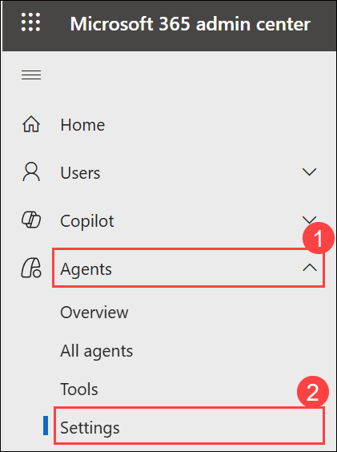

1. Review the configuration options available on the **Agent settings** page:

   - **Agent management rules** - set and run rules to manage or perform actions on agents
   - **Allowed agent types** - specify which categories of AI agents are permitted in the organization
   - **Policy templates** - preset policies, rules, and allow lists for new agents
   - **Sharing** - manage who can share agents and how
   - **User access** - control which users or groups can interact with agents

    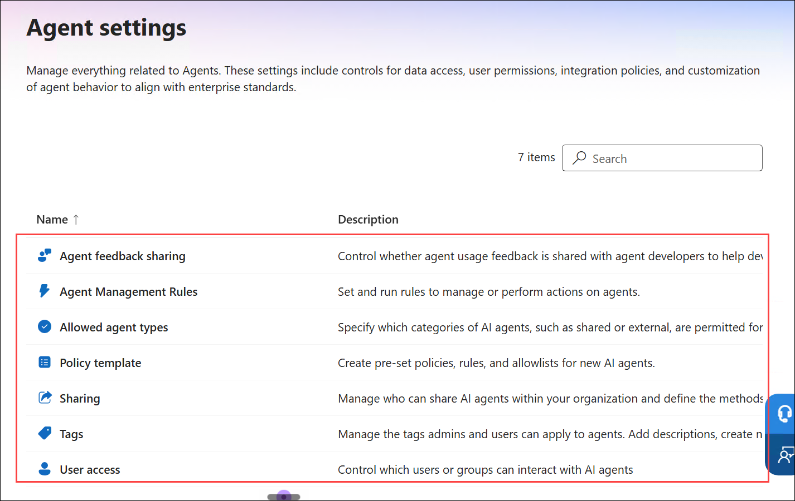

1. Select **Policy templates** to view the policy templates available in your tenant.

1. Select **Default policy templates for agents** to open it.

    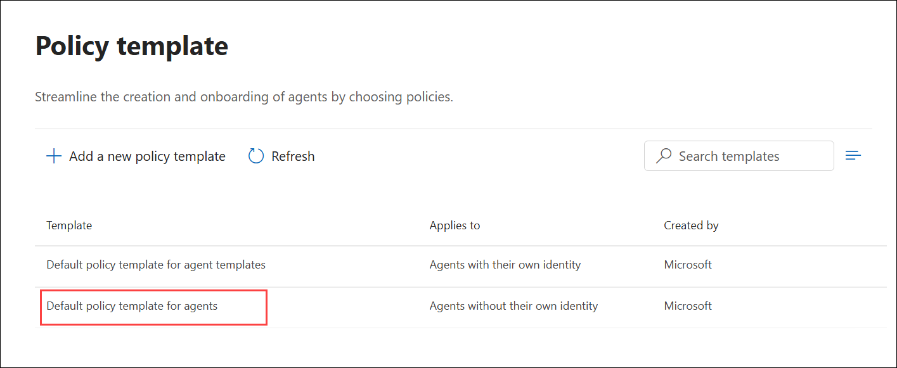

1. Review the bundled policies. **In this lab tenant you will see six policies**, drawn from Microsoft Purview and Microsoft Entra:

    | Policy name | Source service | What it protects against |
    | --- | --- | --- |
    | Purview audit enabled | Microsoft Purview | No record of what the agent did |
    | Detect sensitive information (DSPM) in AI interaction | Microsoft Purview | Sensitive data leaking through agent prompts and responses |
    | Purview AI compliance assessment | Microsoft Purview | Undetected compliance drift over time |
    | Identity protection | Microsoft Entra | Compromised or anomalous agent identities |
    | Network visibility | Microsoft Entra | Unmonitored agent access to external resources |
    | Lifecycle management for agents | Microsoft Entra | Orphaned agents accumulating after owners leave |

    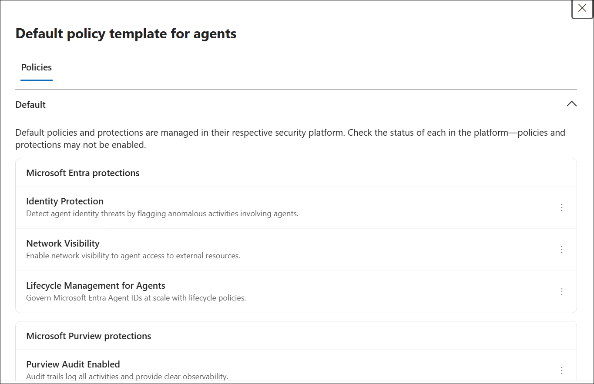

1. Close the template pane without making changes.

### Task 2: Configure tenant guardrails in Agent settings

Policy templates govern individual agents. Agent settings govern the whole tenant: which kinds of agents are allowed to exist at all, who can share them, and who can use them. These are the broadest controls available and the fastest way to reduce your exposure.

1. On the **Agent settings** page, select **Allowed agent types**.
   
    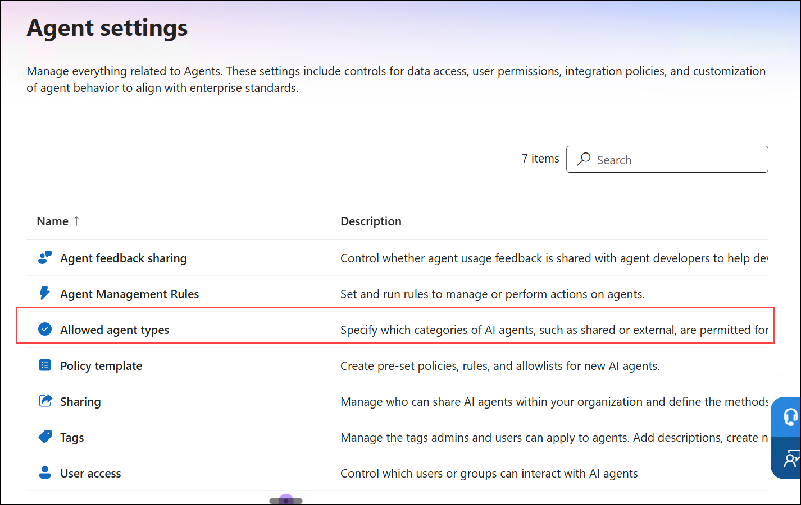

1. Review the three options and note which are enabled:

   - **Allow apps and agents built by Microsoft**
   - **Allow apps and agents built by your organization**
   - **Allow apps and agents built by external publishers**

     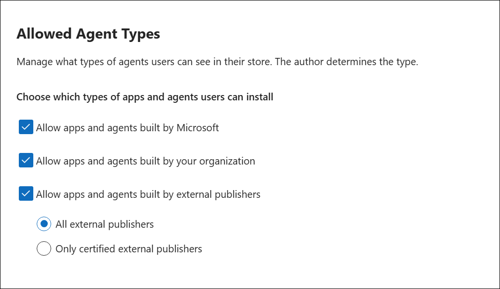

1. Ensure **Allow apps and agents built by your organization** is enabled, because Finley is an organization-built agent and you will publish it later. Select **Save** if you made a change.

1. Return to **Agent settings** and select **Sharing**.

1. Review the three sharing options:

   - **All users** - all users can share their agents with others in your tenant
   - **No users** - org-level sharing is disabled, though users can still share directly with specific individuals
   - **Specific users** - restrict broad sharing permissions to designated groups

1. Select **Specific users (1)**, then select the your **lab user (2)**. Select **Save (3)**.

    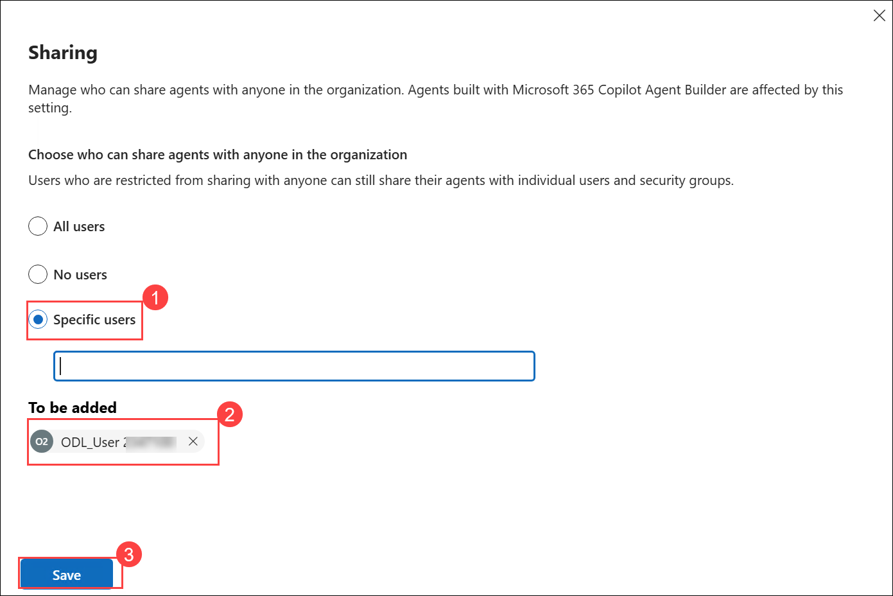

1. Return to **Agent settings** and select **User access**.

1. Review the three options:

   - **All users** - the default; all users can access agents, subject to existing app policies and user assignments
   - **No users** - no users in the organization can access agents
   - **Specific users/groups** - only the users or groups you select can use agents

1. Leave **All users (1)** selected. Select **Close (2)**.

    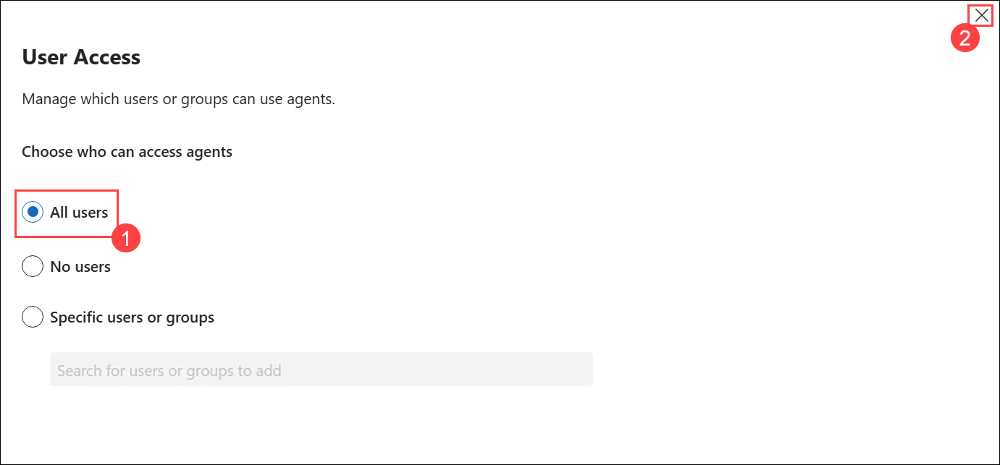

1. Return to **Agent settings** and select **Agent management rules**.

1. Review the supported rule-based bulk actions. These let you apply governance across many agents at once instead of one at a time:

   - **Install Microsoft agents** - proactively deploy Microsoft first-party agents tenant-wide
   - **Reassign ownerless agents created with Agent Builder to manager** - automatically transfer ownership of orphaned agents to the previous owner's manager, based on the Microsoft Entra ID hierarchy

     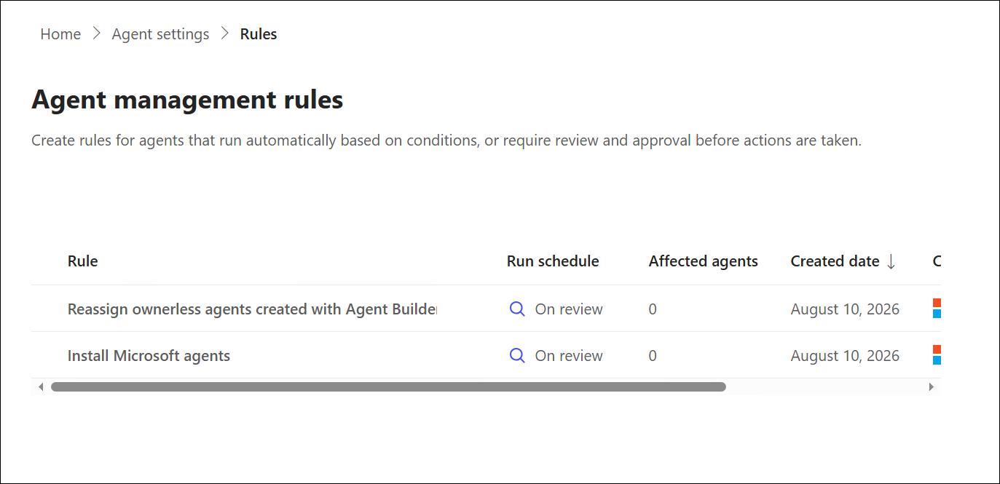

### Task 3: Create and assign custom security attributes

You cannot write "only approved agents may access Finance resources" until you have a way to record which agents are approved. Custom security attributes are that mechanism: business-specific key-value pairs you attach to directory objects and then target in policy.

**Global Administrator does not include permission to define or assign custom security attributes.** These permissions are deliberately separated from tenant administration, so even a Global Administrator sees the attribute controls greyed out until the correct roles are assigned. Your first job in this task is to grant yourself those roles.

>**Note:** This role separation is intentional. Custom security attributes can drive access control decisions, so Microsoft keeps their management behind dedicated roles rather than bundling them into Global Administrator. A Global Administrator **can** assign these roles to themselves, which is what you do next.

1. Switch to the Microsoft Entra admin center tab, or navigate to:

    ```
    https://entra.microsoft.com
    ```

1. In the left navigation pane, expand **Entra ID (1)** and select **Roles & admins (2)**.

    

1. In the search box, type **Attribute Definition Administrator** and select the role from the results.

1. Select **+ Add assignments**.

1. Select your lab user account <inject key="AzureAdUserEmail"></inject>, then select **Add**.

    

1. Return to **Roles & admins**, search for **Attribute Assignment Administrator**, and repeat the assignment for the same account.

1. **Sign out of the Microsoft Entra admin center and sign back in** with the same credentials.

    >**Note:** This step is required, not optional. Role assignments are written into your access token when you sign in. Until you get a fresh token, the attribute controls remain greyed out even though the roles are assigned. If **Add attribute set** is unavailable in the next steps, this sign-out is the step you skipped.

1. In the left navigation pane, expand **Entra ID (1)** and select **Custom security attributes (2)**.

    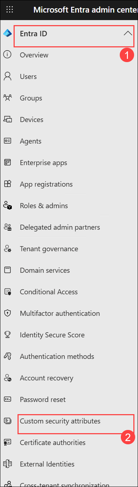

1. Select **Add attribute set**.
    
    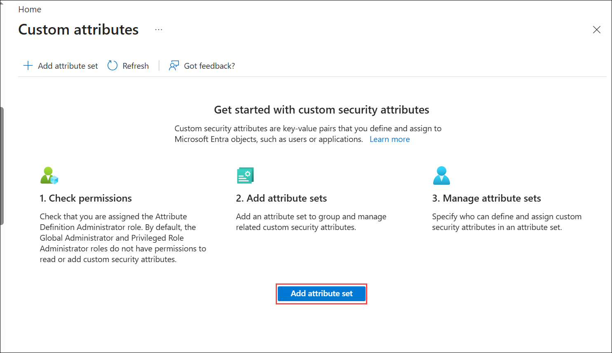

1. Enter the following values, then select **Add (4)**:

   - **Attribute set name: (1)** AgentAttributes
   - **Description: (2)** Attributes used to classify AI agents
   - **Maximum number of attributes: (3)** 25

     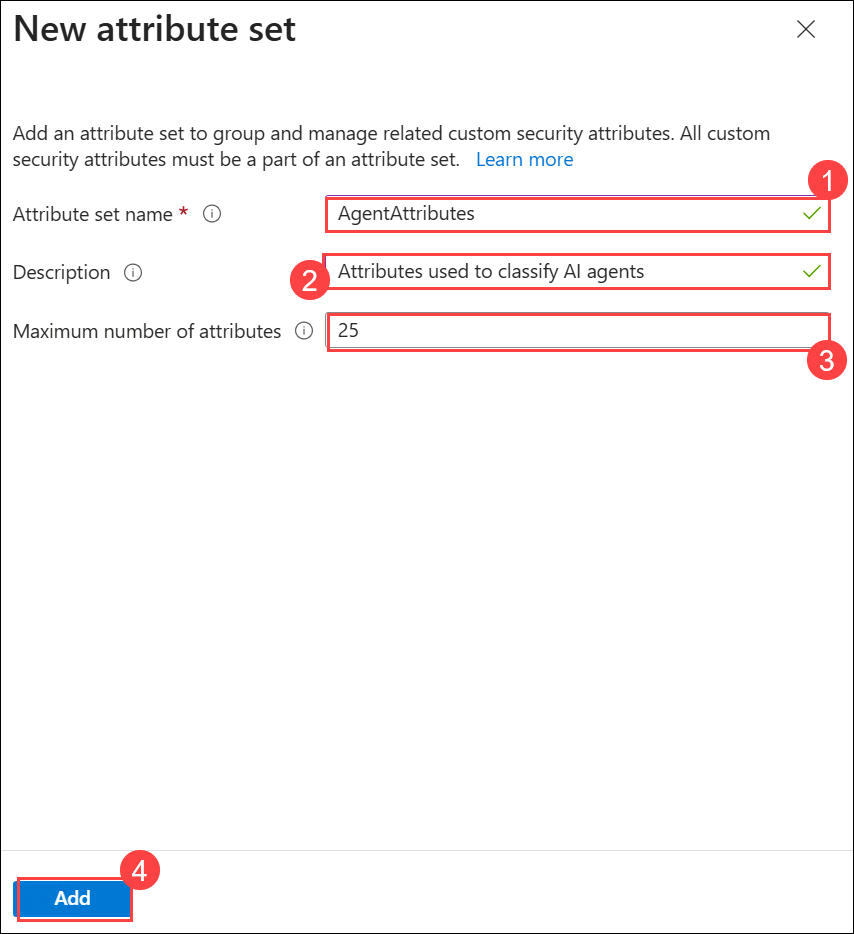

1. Select the **AgentAttributes** attribute set you just created to open it.

     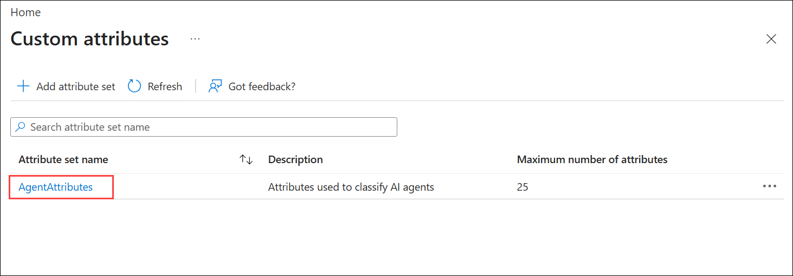

1. Select **Add attribute** and enter the following:

   - **Attribute name: (1)** AgentApprovalStatus
   - **Description: (2)** Review and approval state of the agent
   - **Data type: (3)** String
   - **Allow multiple values to be assigned: (4)** Yes
   - **Only allow predefined values to be assigned: (5)** Yes

    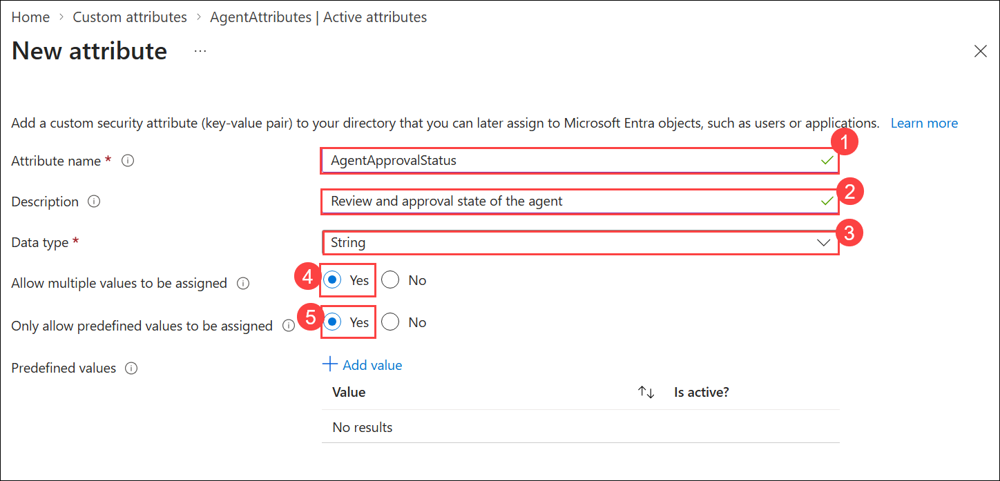

1. Because you selected **Yes** for predefined values, select **+ Add value (1)** and **add (4)** each of the following values, leaving **Is active?** set to **Yes (3)** for each:

   - **New**
   - **In_Review**
   - **HR_Approved**
   - **Finance_Approved**
   - **IT_Approved**

     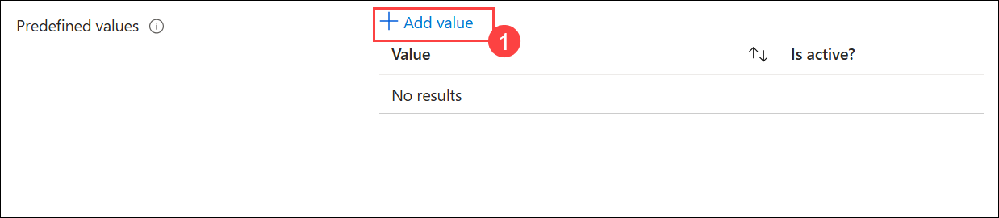

     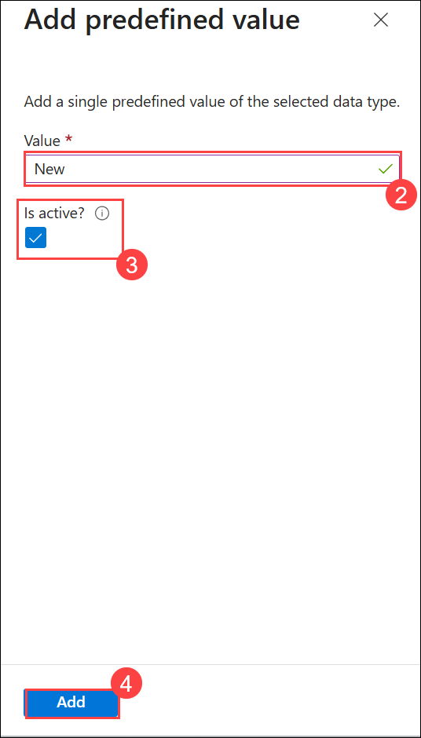

1. Select **Save**.

    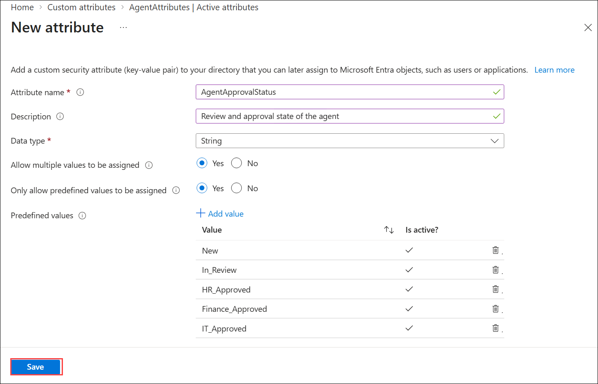

1. Now assign the attribute to Finley. In the left navigation pane, navigate to **Entra ID** > **Agents** > **Agent identities**.

1. Select the agent identity **finley-<inject key="DeploymentID" enableCopy="false"/> Identity** that you created in Exercise 1.

    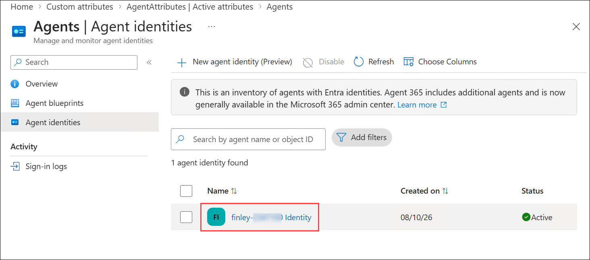

1. In the left navigation pane of the agent identity, select **Custom security attributes (1)**.

1. Select **Add assignment (2)**, then set:

   - **Attribute set:** **AgentAttributes**
   - **Attribute name:** **AgentApprovalStatus**
   - **Assigned value:** **Finance_Approved**

    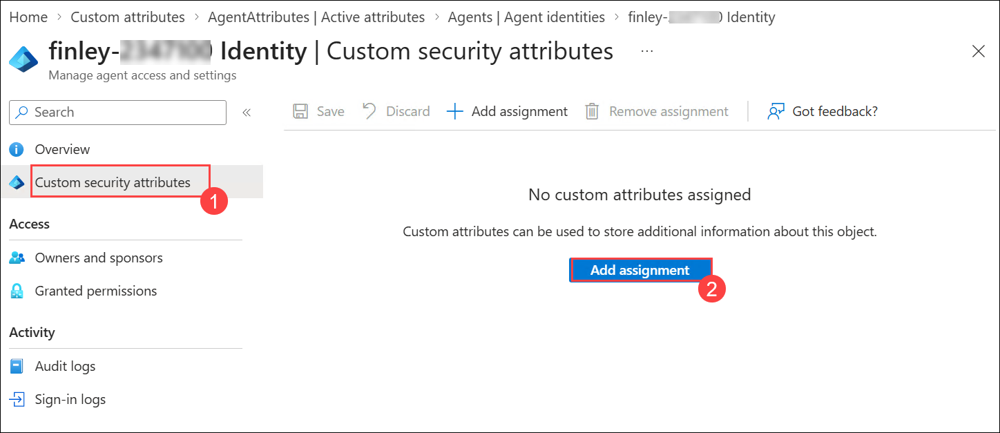

1. Select **Save**, then confirm the assignment now appears in the agent identity's **Custom security attributes** list.

     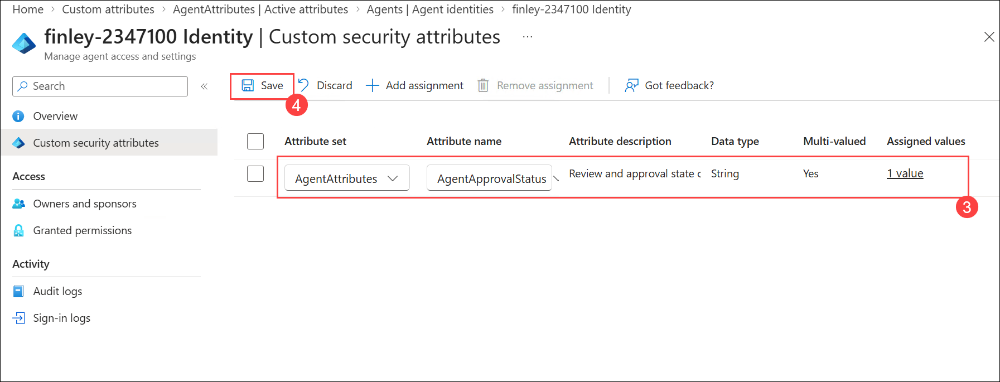

Finley is now tagged as an approved Finance agent. In the next task you write the policy that acts on that tag.

### Task 4: Create an attribute-driven Conditional Access policy

Now you build the rule that uses the tag. The policy blocks all agent identities *except* those carrying the `Finance_Approved` value, which means any new untagged agent that appears in the tenant is denied access by default.

1. In the Microsoft Entra admin center, in the left navigation pane, expand **Entra ID (1)**, select **Conditional Access (2)**, and then select **Policies (3)**.

    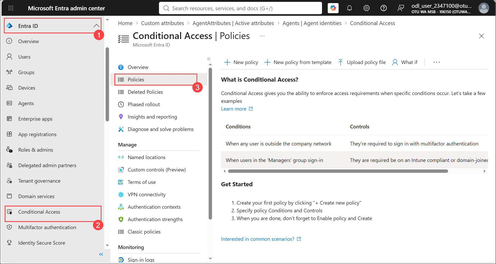

1. Select **+ New policy**.

1. In the **Name (1)** field, enter:

    ```
    CA-Agents-BlockUnapprovedAgents
    ```
1. Under **Assignments**, select **Users or agents (2)**.

1. Under **What does this policy apply to?**, select **Agents (3)**.

1. Under **Include**, select **All agent identities (4)**.

     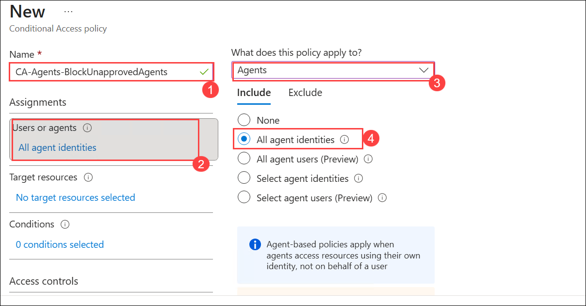

1. Select the **Exclude** tab, then select **Select agent identities > Select based on attributes**.

1. Configure the attribute filter:

   - Set **Configure** to **Yes (1)**
   - **Attribute:** **AgentApprovalStatus (2)**
   - **Operator:** **Contains (3)**
   - **Value:** **Finance_Approved (4)**

    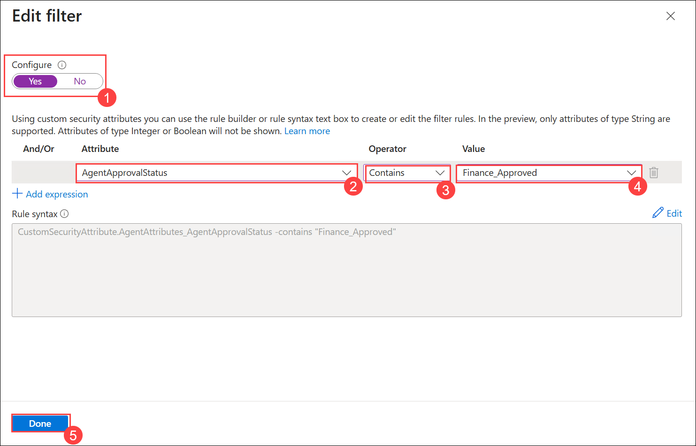

1. Select **Done (5)**.

1. Under **Target resources (1)**, select **Include (2)**, then select **All resources (formerly 'All cloud apps') (3)**.

    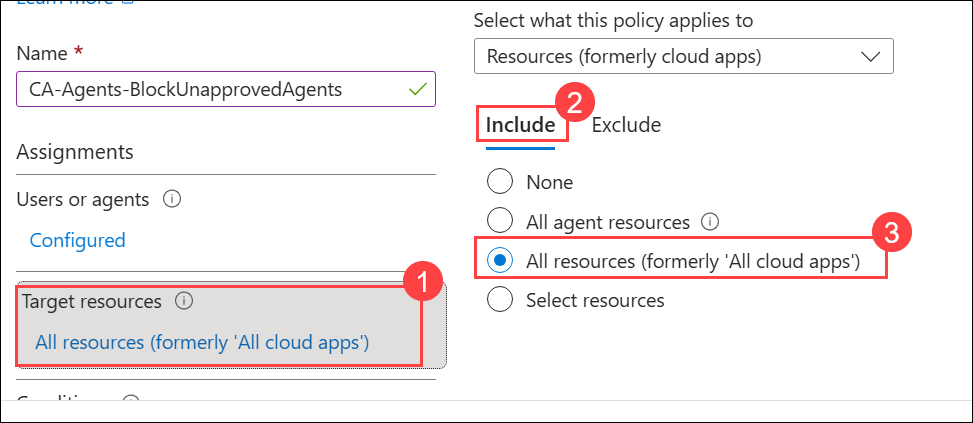

1. Under **Access controls** > **Grant**, select **Block access**, then select **Select**.

    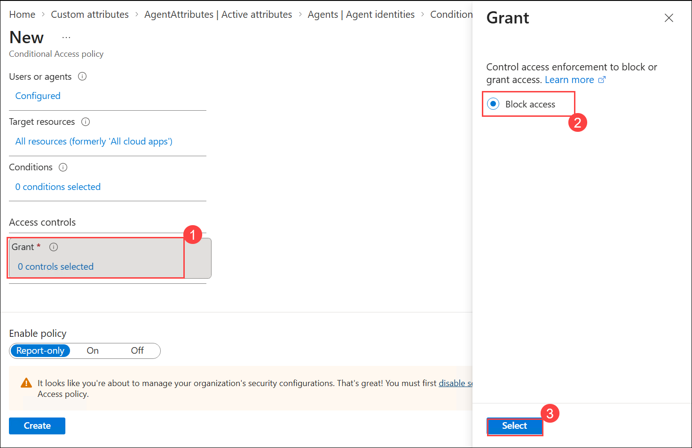

1. At the bottom of the page, set **Enable policy** to **Report-only (1)**.

     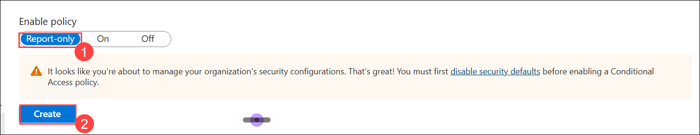

1. Select **Create (2)**.

### Task 5: Create a Conditional Access policy for high-risk agents

The previous policy answers "is this agent approved?". This one answers a different question: "has this agent started behaving suspiciously?". Microsoft Entra ID Protection generates risk signals for agent identities, and Conditional Access can act on them.

1. Still in **Entra ID** > **Conditional Access** > **Policies**, select **+ New policy**.

1. In the **Name** field, enter:

    ```
    CA-Agents-BlockHighRiskAgents
    ```

1. Under **Assignments**, select **Users, agents or workload identities**.

1. Under **What does this policy apply to?**, select **Agents**, then under **Include** select **All agent identities**.

1. Under **Target resources** > **Include**, select **All resources (formerly 'All cloud apps')**.

1. Under **Conditions**, select **Agent risk (Preview)** and set **Configure** to **Yes**.

    >**Note:** When a policy targets agent identities, **Agent risk (Preview)** is the **only** condition available. Conditions such as device platforms, filter for devices, agent execution environments, and network apply only to agent **user** accounts, because they depend on signals that only an endpoint can provide.

1. Under **Configure agent risk levels needed for policy to be enforced**, select **High**.

    

    >**Note:** Microsoft recommends starting with **High** only. Including **Medium** increases the chance of blocking legitimate agent activity. Tune this per your organization's risk tolerance.

1. Under **Access controls** > **Grant**, select **Block access**, then select **Select**.

    >**Note:** For agents authenticating with their own identity there is no remediation path such as multifactor authentication, because no human is present to respond to a prompt. **Block** is the only meaningful control.

1. Set **Enable policy** to **Report-only**, then select **Create**.

1. Select your new policy and review its impact data.

    

1. Confirm both policies now appear in the **Policies** list with a state of **Report-only**.

### Task 6: Review conformance and risk signals in the registry

Finally, close the loop. The Microsoft 365 admin center aggregates signals from Entra, Defender, and Purview into a single view, so an administrator does not have to check three portals to find out whether an agent is a problem.

1. Switch to the Microsoft 365 admin center tab.

1. Navigate to **Agents (1)** > **All agents (2)** and ensure the **Registry (3)** tab is selected.

1. Locate the **Risks** column in the agent list. This column aggregates high-severity risks across Microsoft Entra, Microsoft Defender, and Microsoft Purview.

    

    >**Note:** The Risks column exists to close a specific visibility gap. Before it, an administrator governing agents had to correlate findings across three separate security portals manually.

    >**Note:** The Risks column shows **high severity** risks only. A count of `0` means no high-severity risks, not that the agent is free of all risk. Lower-severity findings remain visible in the individual security portals. There can also be a delay of up to an hour between a detection appearing in a security portal and the count updating here.

1. Select your agent **finley-<inject key="DeploymentID" enableCopy="false"/>** to open the details pane, and review the **Permissions** section to confirm what the agent has been granted.

1. Navigate to **Agents** > **Overview** and review the governance action cards, which surface items such as **Pending requests**, **Agents at risk**, and **Agents without owners**.

    

    >**Note:** Card names and layout on this dashboard change frequently as the preview evolves. Focus on locating the governance cards rather than matching exact tile titles.

1. Confirm that **Agents without owners** does not include your agent, because you assigned owners in Exercise 1.

    >**Note:** Selecting the **Agents without owners** card filters the agent list to ownerless agents so you can triage them directly. Because you closed Finley's accountability gap in Exercise 1, Finley should not appear in that filtered view.

    >**Note:** Governance actions such as approving agent requests or assigning ownership can only be performed by users in the **AI Administrator** or **Global Administrator** roles. Other roles can view governance gaps but cannot remediate them.

## Conclusion

In this exercise you moved Finley from "exists" to "constrained". You reviewed the protections Microsoft enforces by default and traced each back to the service that implements it, tightened tenant-wide guardrails through Agent settings, granted yourself the attribute administrator roles that even a Global Administrator lacks by default, and built the two Conditional Access patterns that matter most for agents at scale: attribute-driven approval and risk-based blocking.

The most transferable idea here is the attribute pattern. Selecting individual agents in a policy works when you have three agents and collapses when you have three hundred. Tagging identities and targeting the tag means policies automatically cover agents that do not exist yet, which is the only approach that survives growth.

## Review

In this exercise, you have completed the following:

- Reviewed the Microsoft default policy template
- Configured tenant guardrails in Agent settings
- Created and assigned custom security attributes
- Created an attribute-driven Conditional Access policy
- Created a Conditional Access policy for high-risk agents
- Reviewed conformance and risk signals in the registry

## Summary

In this exercise, you reviewed the Agent 365 default policy template and mapped its protections to Entra, Purview, SharePoint, and Defender, configured tenant-wide agent guardrails, and built attribute-driven and risk-based Conditional Access policies for agents, validating both safely in report-only mode. These policies govern the same agent identity you provisioned in Exercise 1 and will continue to apply to it in Exercises 3 and 4.

Click **Next** from the lower right corner to move on to the next page.


