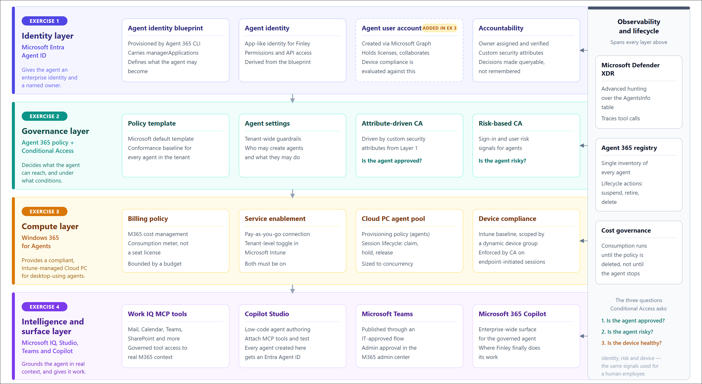
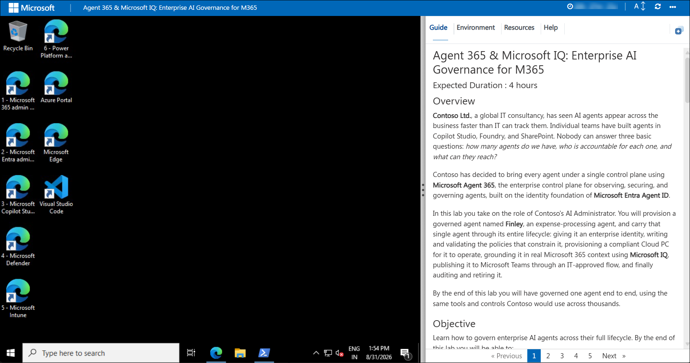
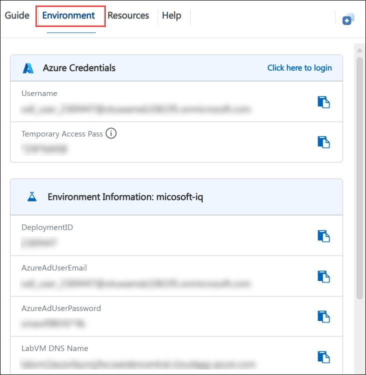
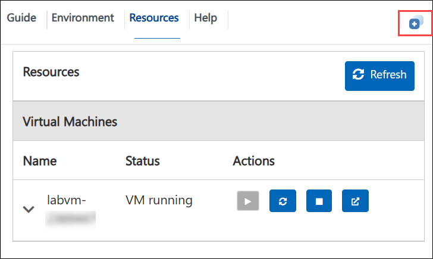
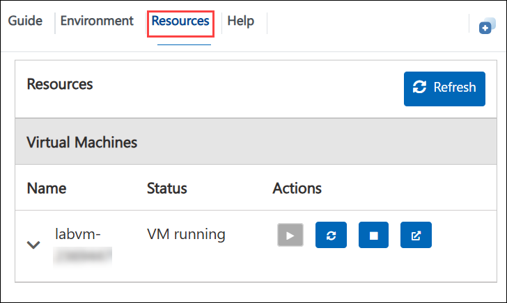
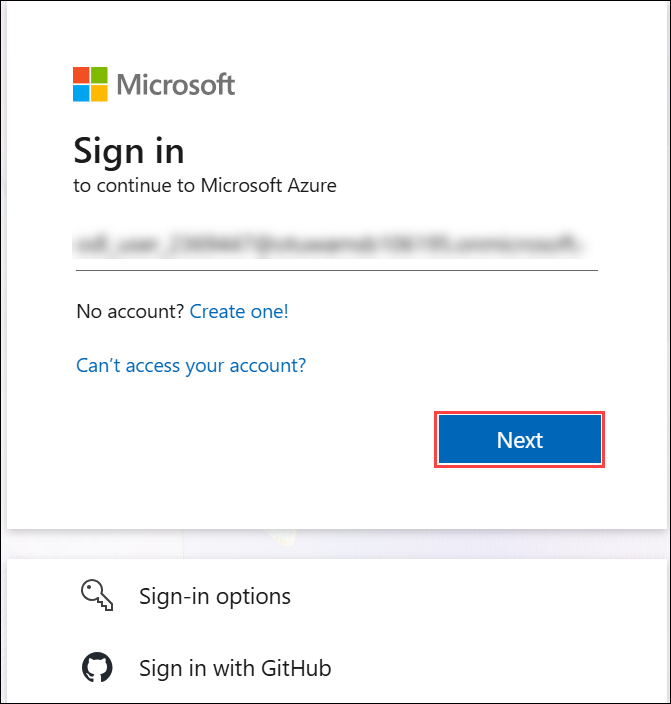
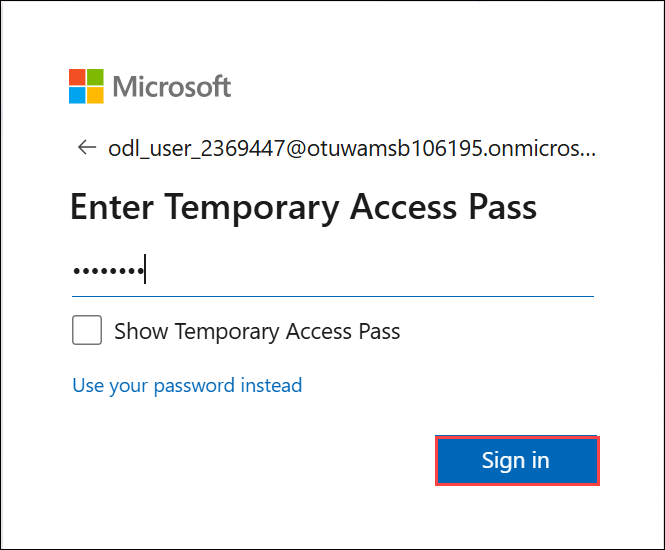
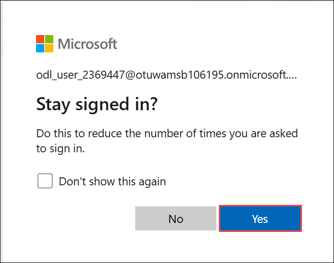

# Agent 365 & Microsoft IQ: Enterprise AI Governance for M365

### Expected Duration : 4 hours

## Overview

**Contoso Ltd.**, a global IT consultancy, has seen AI agents appear across the business faster than IT can track them. Individual teams have built agents in Copilot Studio, Foundry, and SharePoint. Nobody can answer three basic questions: *how many agents do we have, who is accountable for each one, and what can they reach?*

Contoso has decided to bring every agent under a single control plane using **Microsoft Agent 365**, the enterprise control plane for observing, securing, and governing agents, built on the identity foundation of **Microsoft Entra Agent ID**.

In this lab you take on the role of Contoso's AI Administrator. You will provision a governed agent named **Finley**, an expense-processing agent, and carry that single agent through its entire lifecycle: giving it an enterprise identity, writing and validating the policies that constrain it, provisioning a compliant Cloud PC for it to operate, grounding it in real Microsoft 365 context using **Microsoft IQ**, publishing it to Microsoft Teams through an IT-approved flow, and finally auditing and retiring it.

By the end of this lab you will have governed one agent end to end, using the same tools and controls Contoso would use across thousands.

## Objective

Learn how to govern enterprise AI agents across their full lifecycle. By the end of this lab you will be able to:

- **Provision an agent identity** : Create an agent identity blueprint and agent identity in Microsoft Entra using the Agent 365 CLI, and establish accountability with owners and sponsors.
- **Enforce policy conformance** : Review the Agent 365 default policy template, configure tenant guardrails, and build attribute-driven and risk-based Conditional Access policies for agents.
- **Enable and govern agent compute** : Create a Windows 365 for Agents billing policy, enable the service for your tenant, create an agent user account, and define and enforce the compliance baseline that governs agent devices.
- **Ground an agent in Microsoft IQ** : Extend an agent with Work IQ MCP tools so it can act on real Microsoft 365 context.
- **Deploy through governance** : Publish an agent to Microsoft Teams and Microsoft 365 Copilot with admin approval.
- **Observe and retire** : Trace agent tool calls in Microsoft Defender advanced hunting and run lifecycle actions from the Agent 365 registry.

## Prerequisites

Participants should have:

- **Basic Microsoft 365 administration knowledge**: Familiarity with the Microsoft 365 admin center and license assignment.
- **Basic Microsoft Entra knowledge**: Understanding of users, groups, app registrations, and Conditional Access concepts.
- **Comfort running commands**: You will run a small number of copy-paste PowerShell and CLI commands. No programming is required.
- **Understanding of least privilege**: Familiarity with why agents should be granted only the permissions they need.

>**Note:** All licenses, directory roles, and the Azure subscription and resource group used in this lab have been pre-staged in your lab environment. You do not need to purchase or assign anything. 

## Architecture

This lab builds a single governed agent across four layers of the Microsoft stack, and each exercise adds one layer.

The **identity layer** (Microsoft Entra Agent ID) issues the agent an enterprise identity derived from an agent identity blueprint, with an owner and a sponsor for accountability. The **governance layer** (Agent 365 in the Microsoft 365 admin center, plus Entra Conditional Access) applies policy templates and access rules that decide what the agent can reach and under what conditions. The **compute layer** (Windows 365 for Agents) provides a compliant, Intune-managed Cloud PC for agents that need to operate a desktop. The **intelligence and surface layer** (Microsoft IQ Work IQ MCP tools, Copilot Studio, and Microsoft Teams) gives the agent real organizational context and a place to do its work, while Microsoft Defender and the Agent 365 registry provide observability and lifecycle control over everything above.

Because one agent flows through all four layers, the policy you write in Exercise 2 sits alongside the agent device baseline you build in Exercise 3, and both govern the Teams-published agent in Exercise 4.

## Architecture Diagram

 

## Explanation of Components

- **Microsoft Entra Agent ID**: Issues and governs identities for AI agents. Provides agent identity blueprints, agent identities, owners and sponsors, and Conditional Access for agents.
- **Microsoft Agent 365**: The control plane in the Microsoft 365 admin center for observing, securing, and governing every agent in the tenant. Includes the agent registry, agent settings, and policy templates.
- **Agent 365 CLI**: Cross-platform command-line tool that provisions the Azure infrastructure and registers the agent blueprint so the agent is accepted by the Agent 365 platform.
- **Microsoft Intune**: Manages Cloud PCs for Agents through provisioning policies, and supplies the device compliance signal used by Conditional Access.
- **Windows 365 for Agents**: Provides secure, on-demand Cloud PCs with managed identity and a governed agent session lifecycle, for computer-using agents. Metered by a consumption-based billing policy created in Microsoft 365 admin center cost management rather than by seat licences.
- **Microsoft Graph**: Used in this lab to create the agent user account, the user-like identity parented to an agent identity that holds licences and against which device compliance is evaluated.
- **Microsoft IQ / Work IQ**: The intelligence layer that grounds agents in real-time organizational context. Work IQ MCP servers expose governed tools for Mail, Calendar, Teams, SharePoint, and more.
- **Microsoft Copilot Studio**: Low-code environment for authoring agents and attaching tools.

## Getting Started with the Lab
 
## Accessing Your Lab Environment
 
Once you are ready to dive in, your virtual machine and **Guide** will be at your fingertips within your web browser.

   

## Lab Guide Zoom In/Zoom Out

To adjust the zoom level for the environment page, click the **A↕: 100%** icon next to the lab environment's timer.

   

## Virtual Machine & Lab Guide
 
Your virtual machine is your workhorse throughout the workshop. The lab guide is your roadmap to success.
 
## Exploring Your Lab Resources
 
To get a better understanding of your lab resources and credentials, navigate to the **Environment** tab.
 
  
 
## Utilizing the Split Window Feature
 
For convenience, you can open the lab guide in a separate window by selecting the **Split Window** button from the top right corner.
 
 
 
## Managing Your Virtual Machine
 
Feel free to **Start, Stop, or Restart (2)** your virtual machine as needed from the **Resources (1)** tab. Your experience is in your hands!
 
 

### Signing in to Microsoft 365

1. On the lab virtual machine, open **Microsoft Edge** and navigate to the Azure portal.

    ```
    https://portal.azure.com/
    ```

1. On the **Sign in** page, enter the following credentials and click **Next**:

   - **Email/Username:** <inject key="AzureAdUserEmail"></inject>

      

1. Next, provide your Temp Access Pass and click **Sign in**:

   - **Temp Access Pass:** <inject key="AzureAdUserPassword"></inject>

      

1. If prompted with **Stay signed in?**, select **Yes**.

    

1. If a **Welcome to Azure** dialog appears, close it.

## Support Contact

The CloudLabs support team is available 24/7/365 to help resolve any issues you encounter during the lab.

- **Email Support:** cloudlabs-support@spektrasystems.com
- **Live Chat Support:** https://cloudlabs.ai/labs-support

Now click on **Next** from the lower right corner to move on to the next page.


